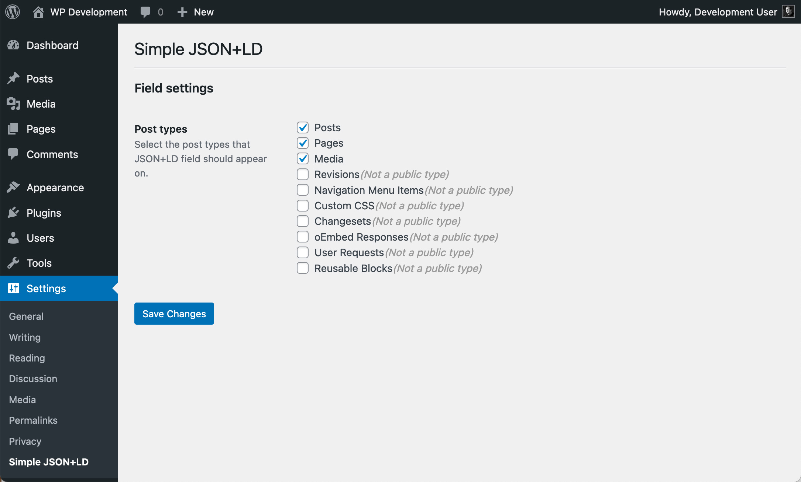
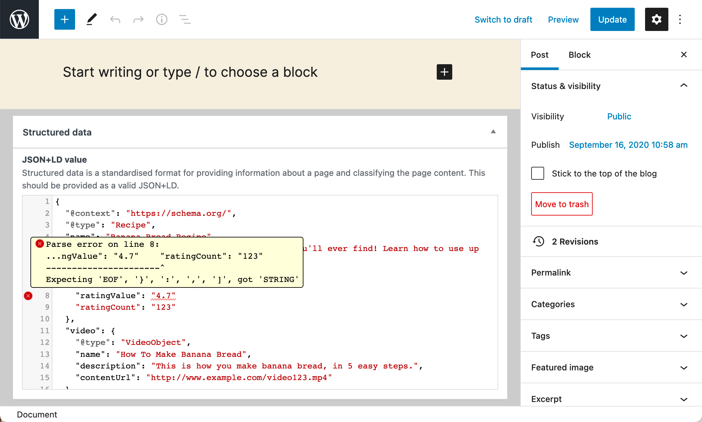
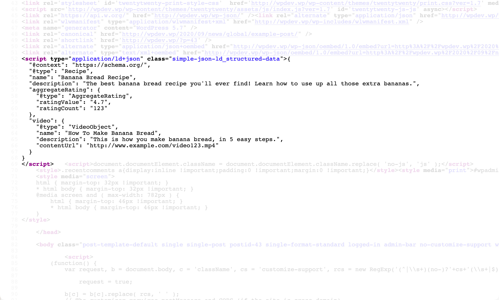

# Simple JSON+LD
A wordPress plugin that adds a basic structured data editor to post types and prints the JSON+LD values into the &lt;head&gt;.

**Settings**

Control which post types the Simple JSON+LD field can be used on.

**Field**

Add structured data to the Simple JSON+LD field and the basic validation will alert you of any errors.

**Frontend**

Below is an example of what's printed on the frontend &lt;head&gt;.

